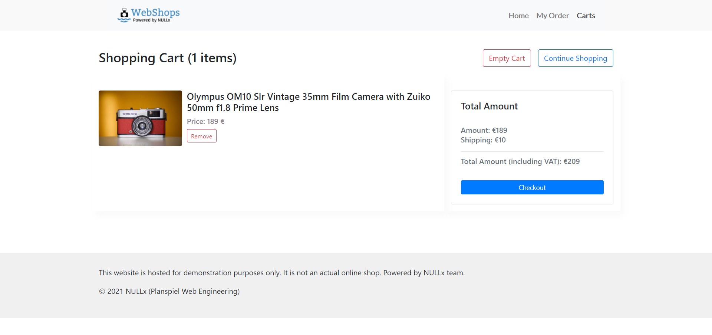

# NULLx

## WebShops (Microservice Demonstration)

The microservice application is a cloud-native microservice Demonstrator. The application is a web-based e-commerce application where users can browse items, add them to the cart, and purchase them.

**WebShops /Homepage URL (Webshops):** http://vsr-kub005.informatik.tu-chemnitz.de:30002/

**NULLx Learning Kit URL:** https://nullx-de.github.io/home/NULLxUI/ 

## Screenshots

| Home Page                                                                                                         | Checkout Screen                                                                                                    |
| ----------------------------------------------------------------------------------------------------------------- | ------------------------------------------------------------------------------------------------------------------ |
|  |  |

# Installation
1. Go to your Virtual Machine or Minikube. 

2. Clone this repository.

```
git clone https://github.com/NULLx-de/WebShops-deployment.git
cd WebShops-deployment
```

2. Deploy MySQL Database to the cluster. 
```
kubectl apply -f mysql-secret.yaml
kubectl apply -f mysql-persistentVolumeClaim.yaml
kubectl apply -f mysql-deployment.yaml
```
3. Deploy MongoDB Database to the cluster. 
```
kubectl apply -f mongo-secret.yaml
kubectl apply -f mongo_server_configmap.yaml
kubectl apply -f mongodb-deployment.yaml
```

4. Deploy microservices of WebShops to the cluster.

```
kubectl apply -f frontend-deployment.yaml
kubectl apply -f inventory-deployment.yaml
kubectl apply -f cartservice-deployment.yaml
kubectl apply -f order-service.yaml
kubectl apply -f shipping-deployment.yaml
```

5. Wait for the Pods to be ready.

```
kubectl get pods
```

After a few minutes, you should see:

```
NAME                                     READY   STATUS    RESTARTS   AGE
cartservice-66d497c6b7-dp5jr             3/3     Running   0          2m59s
frontend-6b8d69b9fb-wjqdg                3/3     Running   0          3m1s
shipping-68596d6dd6-bf6bv                3/3     Running   0          3m
inventory-557d474574-888kr               3/3     Running   0          3m1s
orderservice-69c56b74d4-7z8r5            3/3     Running   0          3m4s
mysql-6ccc89f8fd-v686r                   1/1     Running   0          4m58s
mongo-6ccc89f8fd-v686r                   1/1     Running   0          5m58s
```

6. Access the web frontend in a browser using the frontend's `EXTERNAL_IP`.

```
kubectl get service frontend-microservice | awk '{print $4}'
```


## Architecture

The WebShops is composed of a set of microservices written in different
languages that talk to each other via events, REST API.

[](./architecture_.jpg)


| Service                                              | Language      | Description                                                                                                                       |
| ---------------------------------------------------- | ------------- | --------------------------------------------------------------------------------------------------------------------------------- |
| [frontend](./*)                                      | React.js      | Exposes an HTTP server to serve the website. Does not require signup/login and generates session IDs for all users automatically. |
| [cartService](./*)                                   | Node.js       | Stores the items in the user's shopping cart in Redis and retrieves it.                                                           |
| [orderService](./*)                                  | Node.js       | Handle order request from the cart service                        |
| [inventoryService](./*)                              | Node.js       | Provides the list of products from a JSON file and ability to search products and get individual products.                           |
| [shippingService](./*)                               | Node.js       | Track shippment and send an order-complete event to the order history                                                                |
| [notificationService](./*)                           | Python        | Sends users an order confirmation email (mock).                                                      |
| [orderhistoryService](./*)                           | Node.js       | Provides order history and product catelogues.                                      
| [reviewService](./*)                                 | C#            | Review service for the product. 
  
## Microservice Patterns usages for development

- **[Domain-Driven Design Pattern](https://microservices.io/patterns/decomposition/decompose-by-subdomain.html)**
  Define services corresponding to Domain-Driven Design (DDD) subdomains microservice pattern.
- **[Database per service Pattern](https://microservices.io/patterns/data/database-per-service.html)**
  Most services need to persist data in some kind of database.
- **[Saga Pattern](https://microservices.io/patterns/data/saga.html)**
  A saga is a sequence of local transactions. Each local transaction updates the database and publishes a message or event to trigger the next local transaction in the saga.
- **[API Gateway / Backends for Frontends Pattern](https://microservices.io/patterns/apigateway.html)**
  To give the clients of a Microservices-based application access the individual services.
- **[Messaging Pattern](https://microservices.io/patterns/communication-style/messaging.html)**
  To collaborate and communicate services in a microservice-based application.
- **[Service Instance per container pattern](https://microservices.io/patterns/deployment/service-per-container.html)**
  All the services as a (Docker) container image and deploy each service instance as a container in the kubernetes.


--------------------------------------------------
# Documentation

##	Service Instance Per Service

WebShops has a set of services that need to be packaged and deployed. The most popular approach is using Docker [6] container technology for the deployment so that every microservices can be containerized using the docker image. WebShops is deployed in the Kubernetes cluster. Details discussion is written in chapter 6.

##	Decomposed by business capability

WebShops is a large application therefore the goal is to accelerate the software development of a set of services in such a continuous way that it can be a loosely coupled system. The pattern solved this problem and divided the application into several microservices for example WebShops has cart service, inventory service, order service, shipping service, order history service that means every microservices has its unique responsibility hence the entire system will be loosely coupled. 

##	Database Per Service
In Monolithic architecture, Normally database has a single schema with lots of indexes which leads to tightly coupled interdependency between services. There are so many problems with it for example if we deploy an application and if it needs to be changed we have to redeploy the whole application again. Even if we change a database index we must do the same. So we can imagine the problem of tightly-coupled architecture not easily scalable, every team must look in a single database, if any change is needed, there is no way to do it simultaneously without deploying it again. In a microservices architecture, there is an opportunity to make an application loosely coupled, with no interdependency between services. Every single team only looks forward to their service database. To develop WebShops, we must ensure that WebShops should be loosely coupled so that every microservice can be developed, deployed and scale independently. 
Database per service gives us that opportunity to develop WebShops in such a way if we need to change one service database for example that it does not impact other services at all. Every microservice of WebShops has different data storage requirements. For some services, a relational database is the best choice for example Inventory service, Order service needs SQL base database service. Other services might need a NoSQL database such as MongoDB for example Cart service of WebShops, which is good at storing complex, unstructured data. [5] We applied this pattern with another modification such as a single instance of the database application will be installed in the cluster. Then every microservice will get a dedicated database from the particular server. In our Kubernetes [7] cluster, we deployed MongoDB, MySQL, PostgreSQL server. Microservices of WebShops can access these servers with a dedicated database and user credentials. For those benefits, we found a database per service is the right choice for our application which can fulfil our every requirement.   

## Command Query Responsibility Segregation (CQRS)

WebShops has loosely coupled microservices therefore it is hard to get the join data from multiple services. To solve the problem, we used the CQRS pattern. WebShops has a dedicated microservice called Order History Service which is responsible for providing order data to the end-user. It stores data from Inventory service and Order service in a Read-only database thus, command and query operation segregated into other services which lead to developing a more sophisticated loosely coupled microservice system. 


  


